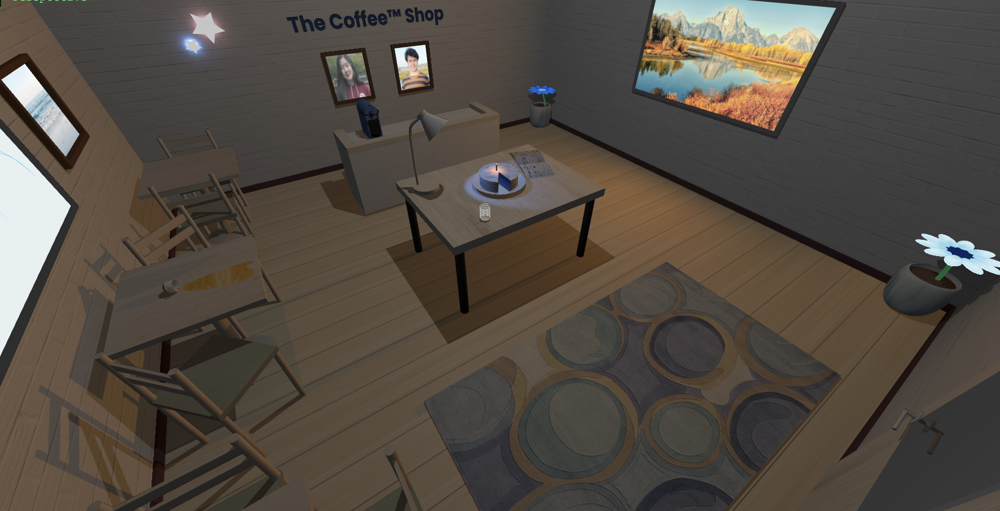
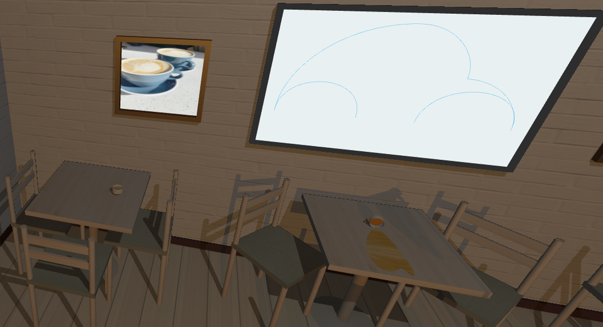
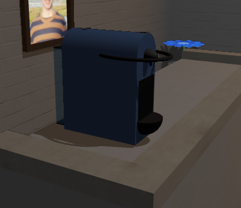

# SGI 2024/2025 - TP1

## Group: T06G02

| Name             | Number    | E-Mail             |
| ---------------- | --------- | ------------------ |
| Madalena Ye         | 202108795 | up202108795@edu.fe.up.pt                |
| Manuel Serrano         | 202402793 | up202402793@edu.fe.up.pt                |

----
## Project information
Our project recreates the cozy, inviting atmosphere of a small, aesthetic coffee shop using Three.js. We aimed to build a warm, detailed space by leveraging the fundamental concepts of geometry, transformations, materials, and lighting covered in our practical classes. With thoughtful use of textures and diverse lighting, we crafted an ambiance reminiscent of a peaceful coffee corner.

One highlight is the use of various light sources to create soft, layered shadows, enhancing the mood and depth of the scene.

### Scene 

The scene we created incorporates all the objects and light sources required. Beyond these essentials, we added a few extra elements to enrich the environment. It features:
* Coffee tables with individual chairs
* Coffee cups and a coffee stain on one of the tables
* A counter with a coffee machine
* A lamp emitting the spotlight
* Star-shaped lights on the wall 
* A shop sign created using text geometry
* A detailed carpet with a pattern
* A door with a window
* A light emitting from the window with a landspace view that provides a cozy atmosphere to the scene

----
## Issues/Problems
- The code structure isn’t entirely polished, as certain procedures could be streamlined into methods for better clarity
- The scene could be further enhanced with more objects like additional furniture or decorations, or a more detailed counter with a barista and more coffee-making equipment